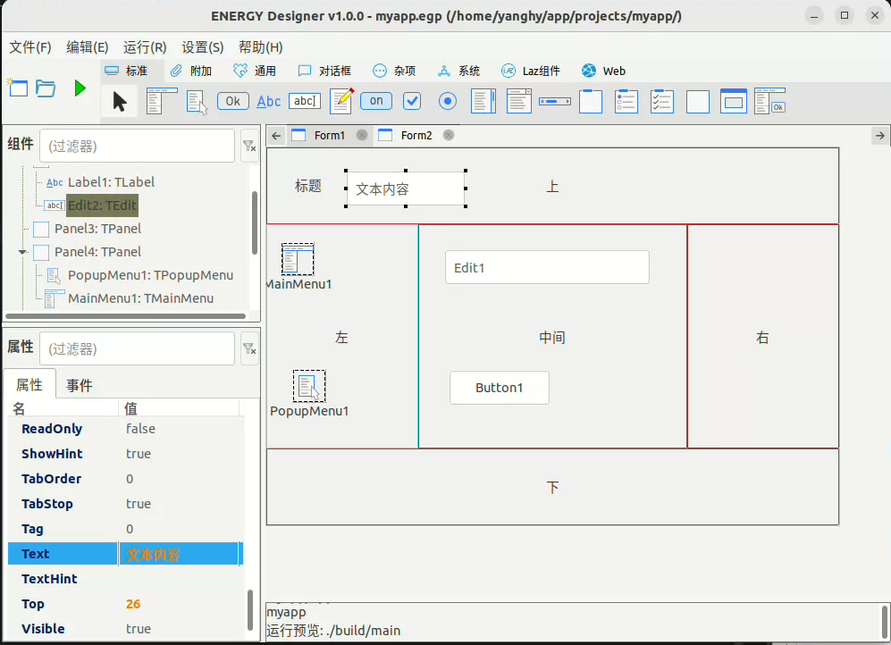
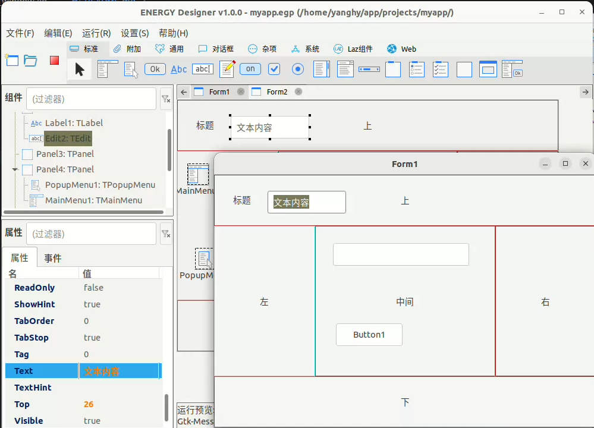

## ENERGY GUI Designer


[](https://github.com/energye/designer)

---

### 🌟 项目简介

ENERGY Designer 是专为 ENERGY 跨平台 GUI 框架打造、且基于该框架开发的可视化设计器，它采用 Go LCL 组件库实现，提供所见即所得的设计体验与简化的 GUI 设计功能，开发者可通过拖拽控件、设置属性直观操作，快速创建和编辑 GUI 界面的同时，还能自动生成对应的 Go 代码。

### 核心特性

####  设计器功能
- **可视化设计**：所见即所得的 GUI 界面设计体验
- **控件拖拽**：支持标准控件的拖拽布局
- **属性编辑**：实时属性和事件设置
- **组件管理**：完整的组件树查看和管理
- **预览运行**：实时预览设计效果

###  使用场景

1. **快速原型开发**：快速构建 GUI 应用
2. **界面设计**：可视化设计复杂的用户界面
3. **代码生成**：自动生 ENERGY GUI 的代码
4. **丰富的组件**：原生控件, CEF控件, Webview控件

*ENERGY Designer - 让 GUI 开发更简单*

### 安装 Designer

#### 环境
- 安装 git
- 安装 golang
- 执行下面命令
```cmd
# 克隆
git clone https://github.com/energye/designer.git

# 进入 designer 目录, 更新模块依赖
go mod tidy
```
- 运行进入 designer 目录

`go run main.go`

如果有需求，请提 issue, 或加入 QQ 群进行交流（541258627）

### 截图





