## ENERGY GUI Designer


[](https://github.com/energye/designer)

---

### 🌟 项目简介

ENERGY Designer 是专为 ENERGY 跨平台 GUI 框架打造的可视化设计器，基于 Go LCL 组件库开发。它提供所见即所得的设计体验与简化的 GUI 设计功能，开发者可通过拖拽控件、设置属性进行直观操作，快速创建和编辑 GUI 界面，同时自动生成对应的 Go 代码。

### 核心特性

####  设计器功能
- 可视化设计：所见即所得的 GUI 界面设计体验
- 控件拖拽：支持标准控件的拖拽布局
- 属性编辑：实时属性和事件设置
- 组件管理：完整的组件树查看和管理
- 预览运行：预览设计效果
- 代码生成：自动将 UI 设计转换为 Go 源代码
- 多窗体支持：支持多标签页窗体设计
- 撤销恢复：支持设计操作的撤销与恢复

### 支持的组件类型

- LCL 原生控件：标准桌面应用程序控件
- CEF 控件：Chromium Embedded Framework 浏览器控件
- WebView 控件：系统原生 Webview 控件（Windows WebView2、Linux WebKit2、macOS WKWebView）

### 跨平台支持

- Windows：支持 386、amd64 架构
- macOS：支持 Intel (amd64) 和 Apple Silicon (arm64) 架构
- Linux：支持 amd64、386、arm64、arm 架构

###  使用场景

1. 快速原型开发：快速构建 GUI 应用原型
2. 界面设计：可视化设计复杂的用户界面
3. 代码生成：自动生成符合 ENERGY 规范的 Go 代码
4. 学习工具：帮助初学者理解 GUI 编程概念

*ENERGY Designer - 让 GUI 开发更简单*

### 安装 Designer

#### 环境
- 安装 git
- 安装 golang
- 执行下面命令
```cmd
# 克隆
git clone https://github.com/energye/designer.git

# 进入 designer 目录, 更新模块依赖
go mod tidy
```
- 运行进入 designer 目录

`go run main.go`

如果有需求，请提 issue, 或加入 QQ 群进行交流（541258627）

### 截图

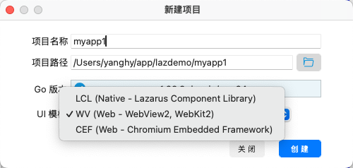
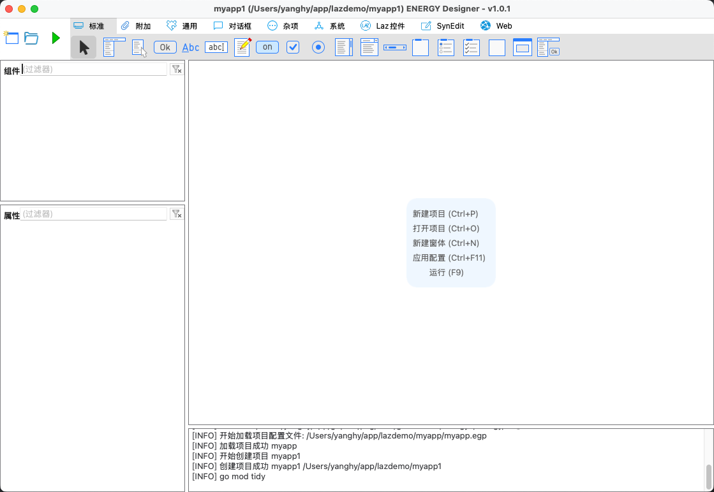
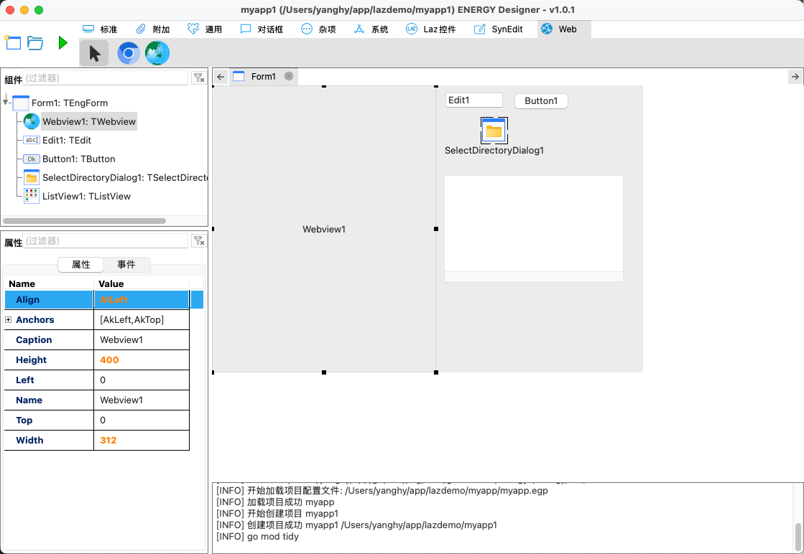
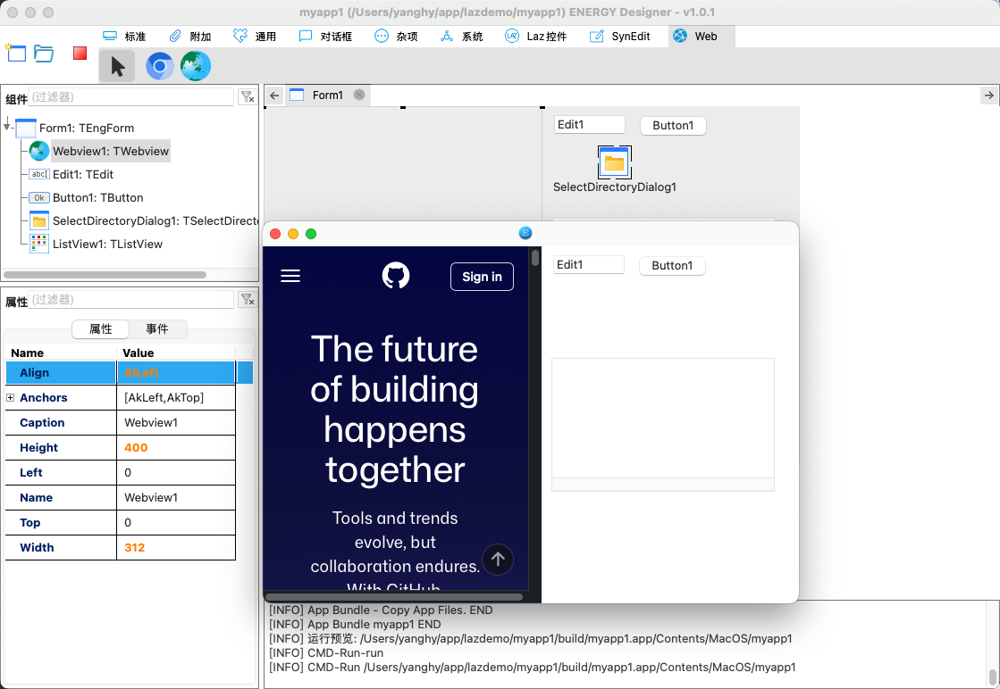
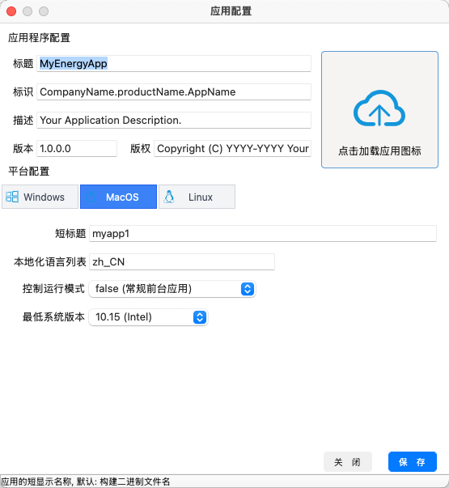
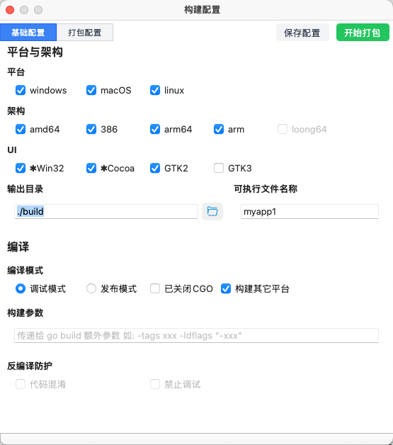
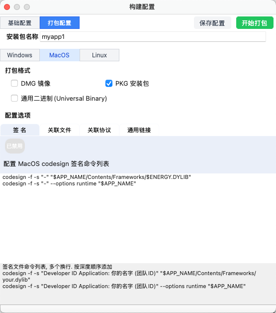
- menu

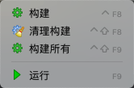
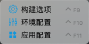
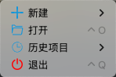
- main.go

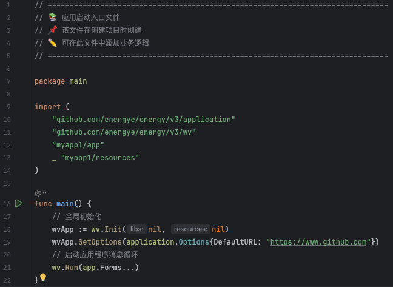
- form1.go

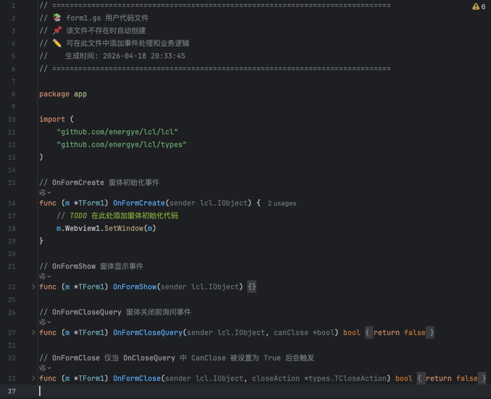